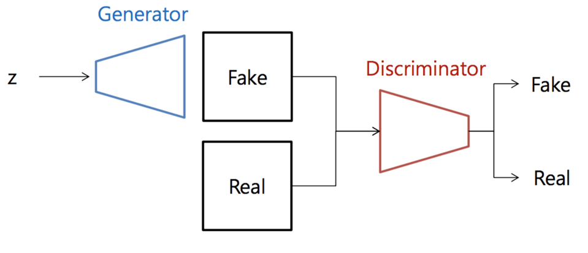
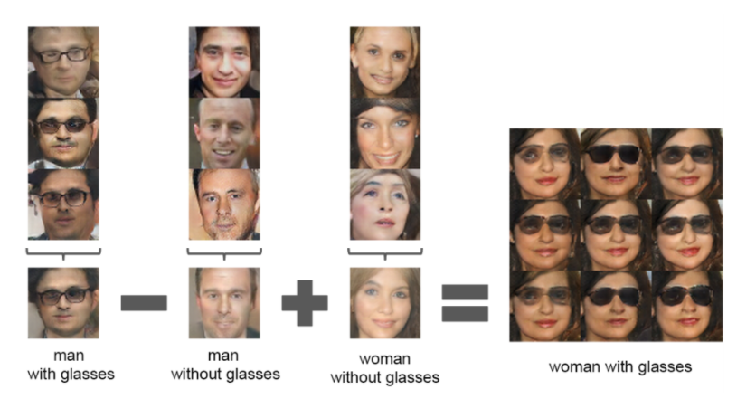
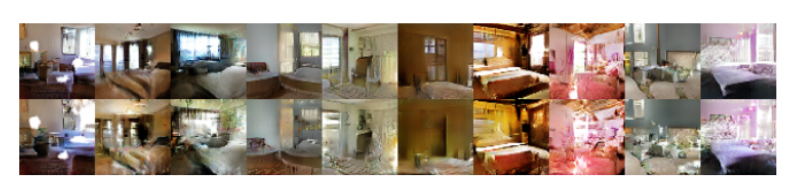
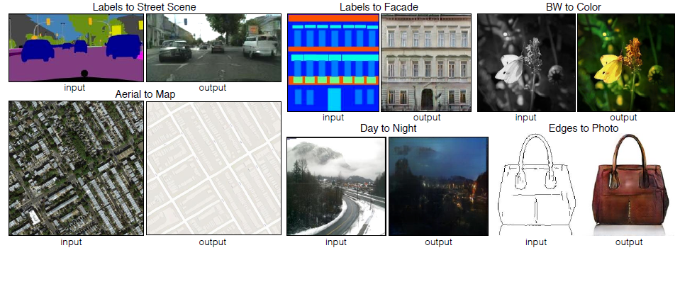
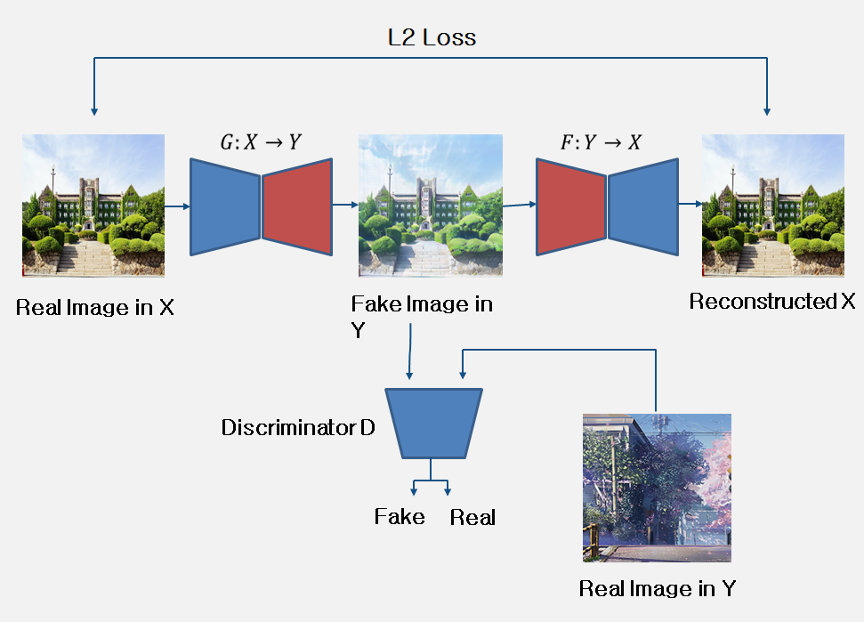
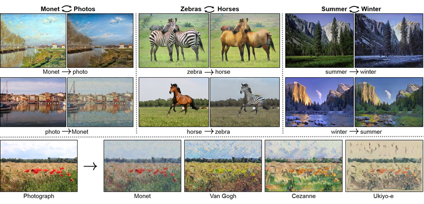
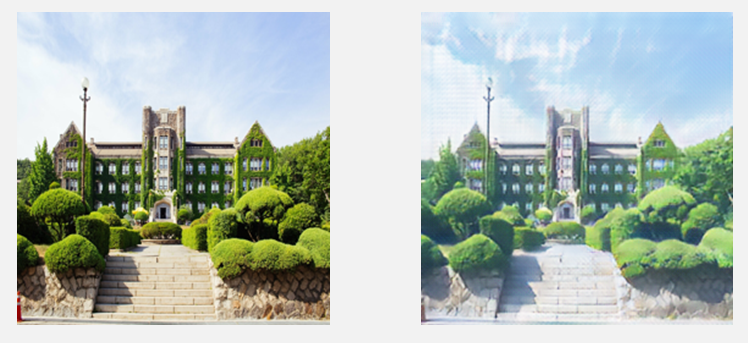
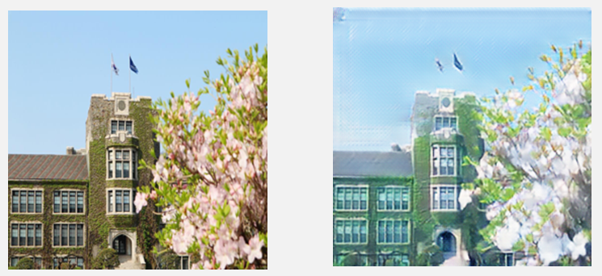
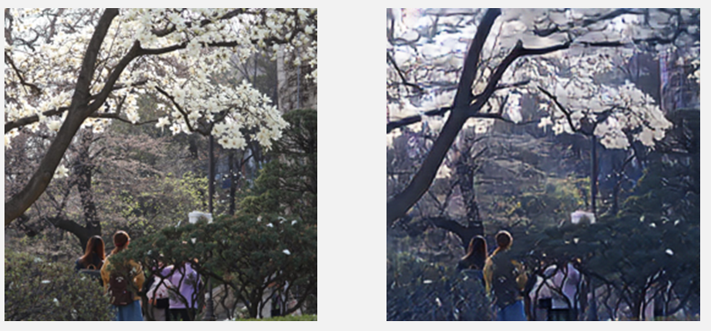

# Cycle-GAN
First Deep Learning Project at YBIGTA (2020-02-29)  

2019년 겨울방학동안 학회 신입 교육 후 신입 학회원(김성윤, 박준민, 유승수, 장현우, 조석주)끼리 첫 프로젝트를 진행했다.  
Machine Learning과 Deep Learning에 관한 기초만을 배운 상태에서 프로젝트를 진행하다 보니 새로운 것을 만들기 보다는 나와있는 것을 구현하는 것을 목표로 했다.  

주제는 실제 사진을 애니메이션 느낌의 사진으로 스타일을 바꾸기로 정했다. 
구현하기 위한 여러 방법들을 찾던 중 GAN(Generative Adversarial Network)을 통해 주제를 구현할 수 있음을 알게 됐다.  

GAN은 두 개의 네트워크(Generator, Discriminator)를 가지며, Generator는 가짜 이미지를 생성하고 Discriminator는 가짜 이미지와 진짜 이미지를 구분하는 역할을 한다. 
Generator는 Discriminator를 속이는 방향으로 학습하며, Discriminator는 진짜와 가짜를 잘 판별할 수 있는 방향으로 학습한다.
이 과정을 통해 Generator는 진짜와 비슷한 가짜 사진을 만들어내게 된다. 

GAN에 대해서 알아보다보니, Deep Convolutional GAN(DCGAN), Conditional GAN, Cycle GAN 등 여러 종류가 있었다.  

DCGAN은 Convolutional 구조를 GAN에 접목하여 기존의 GAN보다 성능을 크게 높였다. 

 
위 사진과 같이 KING - MAN + WOMAN = QUEEN 의 문제를 이미지를 통해 구현이 가능하며, Generator의 input을 조정하여 창문 등을 넣거나 뺄 수 있는 특징이 있다.  

cGAN은 Generator가 만들어내는 그림에 조건을 걸어 원하는 그림을 생성할 수 있는 특징을 가진다. 

 
Cycle GAN은 Generator, Discriminator 각각 2개씩 가지며, 하나는 스타일 a의 이미지를 스타일 b로, 다른 하나는 스타일 b의 이미지를 스타일 a로 바꾸도록 학습하여 a -> b ->a'를 통한 a'과 a의 차이를 loss로 학습하게된다. 

Cycle GAN을 통해 다음과 같은 것들을 할 수 있다. 

여러 GAN 중, Cycle GAN이 팀의 주제에 가장 적절하다고 판단하여 Cycle GAN을 사용하기로 했다.  

우선, 신카이 마코도 감독의 애니매에션 이미지를 1500장, 실제 건물, 거리, 하늘 사진 등을 1200장 크롤링하였다. 
Cycle GAN을 개발한 연구진의 git-hub를 참고하여 학습 시켰다. 
(https://junyanz.github.io/CycleGAN/)   

### 결과
최종적으로 학습 시킨 Generator에 연세대학교 건물 사진을 입력시켰을 때의 결과는 다음과 같다. 

### 한계점
Google Cloud Platform을 통해 학습시켰음에도 네트워크 구조가 복잡하여 시간이 굉장히 오래걸렸다. 
이러한 이유로 충분히 학습시키기 어려웠다. 
또한, 실제 사진과 애니메이션 스타일 이미지의 피사체 차이가 커서 높은 성능으로 학습시키는데 한계가 있었다. 
  
### Reference
1. Goodfellow, I., Pouget-Abadie, J., Mirza, M., Xu, B., Warde-Farley, D., Ozair, S., ... & Bengio, Y. (2014). Generative adversarial nets. In Advances in neural information processing systems (pp. 2672-2680). 
2. Isola, P., Zhu, J. Y., Zhou, T., & Efros, A. A. (2017). Image-to-image translation with conditional adversarial networks. In Proceedings of the IEEE conference on computer vision and pattern recognition (pp. 1125-1134). 
3. Zhu, J. Y., Park, T., Isola, P., & Efros, A. A. (2017). Unpaired image-to-image translation using cycle-consistent adversarial networks. In Proceedings of the IEEE international conference on computer vision (pp. 2223-2232). 
4. Chen, Y., Lai, Y. K., & Liu, Y. J. (2018). Cartoongan: Generative adversarial networks for photo cartoonization. In Proceedings of the IEEE conference on computer vision and pattern recognition (pp. 9465-9474).

   

여담으로 이때까지만 해도 GAN은 이미지 생성에만 쓰인다고 생각했지만, 추후 학교 수업을 통해 data 보호를 위해 가짜 data를 생성할 때 GAN을 사용할 수 있다는 것을 알았다.
